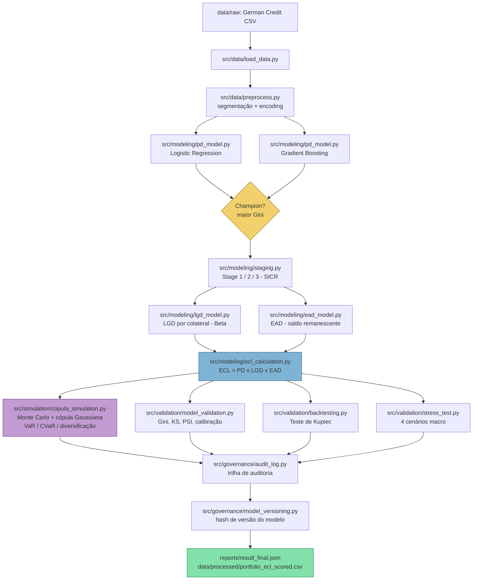

# Diagrama de Arquitetura — Credit Risk ECL Engine



## Camadas do sistema

| Camada | Módulos | Responsabilidade |
|---|---|---|
| **Dados** | `src/data/` | Carga, limpeza, segmentação, encoding |
| **Modelagem** | `src/modeling/` | PD, staging IFRS 9, LGD, EAD, ECL |
| **Simulação** | `src/simulation/` | Monte Carlo com correlação (cópula) |
| **Validação** | `src/validation/` | Métricas estatísticas, backtesting, stress test |
| **Governança** | `src/governance/` | Auditoria, versionamento |
| **Orquestração** | `src/cloud/pipeline.py` | Executa o fluxo completo, ponto único de entrada |

## Fluxo de dados por contrato

```
contrato individual
   → atributos (status, histórico, garantia, valor, prazo, ...)
   → PD 12m (modelo campeão)
   → PD originação (proxy) → comparação → Stage (1/2/3)
   → PD lifetime (se Stage 2/3)
   → LGD (segmento de garantia)
   → EAD (saldo remanescente)
   → ECL do contrato = PD_usada x LGD x EAD
   → soma na carteira → ECL total, por stage, por segmento
   → simulação correlacionada → distribuição de perda agregada → VaR/CVaR
```
